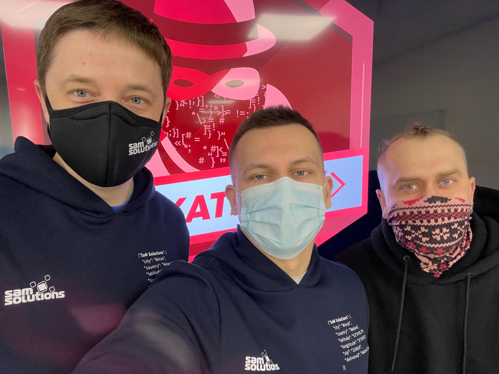

# Sitecore Hackathon 2021

- MUST READ: **[Submission requirements](SUBMISSION_REQUIREMENTS.md)**
- [Entry form template](ENTRYFORM.md)
- [Starter kit instructions](STARTERKIT_INSTRUCTIONS.md)
  

## Team name

### **Free Belarusians Team**

## Category
The Best enhancement to the Sitecore Admin (XP) for Content Editors & Marketers

## Description
The "Managed Synonyms" module resolves an issue with managing the SOLR synonyms in the Sitecore. It was impossible before. 

Our entry in the Sitecore Hackathon 2021 is to make a posibillity for both the developers and the content authors to manage the synonyms flexible and fast through the module in the Sitecore. 

You can know more by [this documentation.](/SynonymsManagedModule.md)

_You can alternately paste a  to a document within this repo containing the description._

## Video link
[Here our demonstration video](https://youtu.be/b06atJLcQuY)

## Pre-requisites and Dependencies

NuGet Dependencies: 

- Newtonsoft.Json v. 11.0.2
- SolrNet v. 1.0.19

## Installation instructions
 
1. Donwload the [Managed Synonyms Package](/SitecorePackage) and Upload it to the Sitecore using the Installation Wizard 

 

2. Select "Managed Synonyms Package"

 
 <!-- Finished here -->

### Configuration
⟹ If there are any custom configuration that has to be set manually then remember to add all details here.

_Remove this subsection if your entry does not require any configuration that is not fully covered in the installation instructions already_

## Usage instructions

When the  successfully installed, go through the following steps:

1. Populate a target search index schema (in our case - the SXA master index)

 

2. In the Content Editor navigate to */sitecore/system/Modules/**ManagedSynonyms*** and put a target index's core name (just validate in SOLR). Also, possible to put more than one using the `|` between names

 

3. Select the **ManagedSynonyms** item and insert (using Insert Options) the `ManagedSynonym` item

 

4. Put the synonyms to the **Synonyms** field. Use the `|` between words.

 

5. Navigate to the custom Sitecore Reabon - **ManagedSynonyms** and click the **Sync Managed Synonyms** action. Confirm the dialog and make sure you got the Success message after - that means the synomyms published to the SOLR

 

6. Validate the synomyns published to the target index's schema with the following link (do not forget to put your target index name) 

Example url: https://localhost:8985/solr/sc.hackaton_sxa_master_index/schema/analysis/synonyms/english

 

7. Go to the site and try to search with added synonyms

 

8. The Result of search doesn't contain `superman` word anywhere. It's just synonym of `mvp` word.
